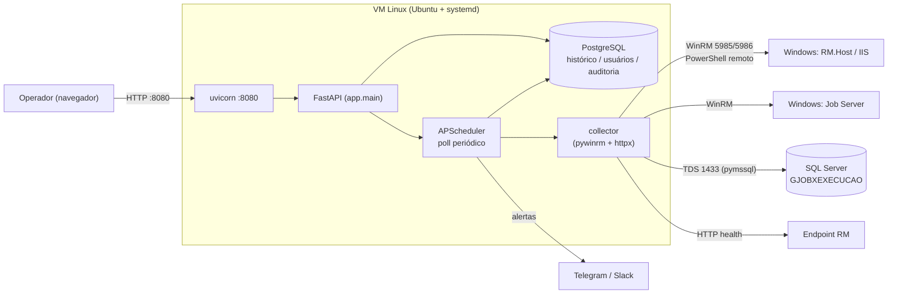

<h1 align="center">RMonitor (RMon)</h1>

<p align="center">
  Painel web de monitoramento para servidores <b>Windows do TOTVS RM</b> —
  coleta por WinRM (PowerShell remoto), histórico, alertas e ações remotas.
</p>

<p align="center">
  
  
  
  
  
</p>

---

## ✨ Visão geral

O **RMonitor** conecta-se aos servidores Windows que rodam o **TOTVS RM** (aplicação,
IIS, SQL Server e job servers), coleta métricas e estado a cada ciclo via **WinRM**,
grava o histórico em **PostgreSQL** e expõe um painel web com login, alertas e ações
operacionais. Roda como serviço `systemd` numa VM Linux — nada é instalado nos
servidores monitorados.

### O que ele coleta e mostra

| Categoria | Detalhe |
|---|---|
| **Host** | CPU, memória, discos (uso %), uptime, nº de sessões logadas |
| **Serviços Windows** | Estado de serviços-chave (`RM.Host.Service*`, `W3SVC`, `MSSQLSERVER`…) |
| **Saúde da aplicação** | Checagem HTTP de um endpoint configurável (status + latência) |
| **Ocorrências** | Erros/críticos recentes do Event Log (System/Application), agrupados e filtrados por provedor |
| **Jobs do RM** | Sucesso × falha na tabela `GJOBXEXECUCAO` (SQL Server), por job server e por solicitante |
| **Sessões RDP** | Lista de usuários logados (`quser`) com opção de **encerrar sessão** (`logoff`) |

### O que ele faz

- 🔔 **Alertas** por Telegram e/ou Slack — disparados só nas **transições** (levantou/resolveu), sem spam.
- 🛠️ **Ações remotas** (perfil admin): `start`/`stop`/`restart` de serviços monitorados e logoff de sessões RDP.
- 👥 **Multiusuário** com papéis `admin` / `viewer`, auditoria de ações e login por sessão assinada.
- 📺 **Mural de TV** (`/tv`): painel em tela cheia, sem rolagem, que se ajusta sozinho ao número de servidores e à resolução da tela. É a **única** tela do perfil `viewer` — ideal para deixar numa TV do NOC.
- 🌐 **Multidomínio**: credenciais WinRM por *perfil* (ex.: `fin`, `rh`), cada servidor referencia o seu.

> 📸 *Dica: adicione aqui uma captura de tela do dashboard (`docs/img/dashboard.png`).*

## 🏗️ Arquitetura



**Stack:** FastAPI · pywinrm · APScheduler · psycopg (PostgreSQL) · pymssql (SQL Server) · Jinja2 · uvicorn.

## 📁 Estrutura do repositório

```
app/                 Backend FastAPI + templates (Jinja2) + estáticos
  main.py            Rotas: login, dashboard, mural de TV, servidor, jobs, sessões, admin…
  collector.py       Coleta WinRM (PowerShell) + health HTTP + ações remotas
  scheduler.py       Polling periódico, detecção de problemas e alertas
  db.py              Camada PostgreSQL (psycopg3) + schema
  jobstats.py        Estatísticas de jobs do RM (SQL Server)
  notify.py          Envio de alertas (Telegram / Slack)
  config.py          Carga de .env + inventário YAML
  security.py        Hash de senha (pbkdf2, stdlib)
config/
  servers.example.yaml   Inventário de exemplo (o servers.yaml real não é versionado)
deploy/
  instalar.sh        Instalador idempotente (Ubuntu): provisiona tudo
  rmon.service       Unit systemd (com sandbox/endurecimento)
  definir-*.sh       Helpers p/ gravar segredos no .env (senha, WinRM, SQL, Telegram, Slack)
  usuarios.py        CLI de usuários do painel
  descobrir.py       Descoberta de serviços RM/SQL/IIS nos alvos
docs/                Documentação técnica (instalação, config, operação, arquitetura)
requirements.txt
.env.example         Modelo das variáveis de ambiente / segredos
```

## 🚀 Instalação rápida (produção)

Numa VM **Ubuntu/Debian**, com o código já presente:

```bash
sudo deploy/instalar.sh
```

O instalador é **idempotente** e cuida de tudo: pacotes de SO, usuário de serviço
`rmon`, virtualenv, **provisão do PostgreSQL** (role + database + DSN), inventário,
geração do `.env` (perm `600`, pedindo a senha do admin e a credencial WinRM) e o
serviço `systemd`. Ao final valida `http://127.0.0.1:8080/healthz`.

Depois, ajuste o inventário e as credenciais por perfil:

```bash
sudoedit /opt/rmon/config/servers.yaml
sudo deploy/definir-winrm.sh fin      # e/ou: rh, etc.
sudo systemctl restart rmon
```

👉 Passo a passo completo em **[docs/INSTALACAO.md](docs/INSTALACAO.md)**.

## 💻 Desenvolvimento local

```bash
python -m venv .venv && . .venv/Scripts/activate    # Windows
# (Linux/macOS: source .venv/bin/activate)
pip install -r requirements.txt

cp .env.example .env                 # preencha RMON_SECRET_KEY, RMON_DB_DSN e o hash do admin
cp config/servers.example.yaml config/servers.yaml
uvicorn app.main:app --reload
```

Gerar o hash de uma senha para o `.env`:

```bash
python -c "from app.security import hash_password; print(hash_password('minhasenha'))"
```

Requer um PostgreSQL acessível pelo `RMON_DB_DSN`. Detalhes em
**[docs/DESENVOLVIMENTO.md](docs/DESENVOLVIMENTO.md)**.

## ⚙️ Configuração

- **`config/servers.yaml`** — inventário: servidores, serviços monitorados, `app_health`, `jobs`, perfil de credencial (`cred`) e limiares de alerta.
- **`.env`** — segredos: chave de sessão, hash do admin, DSN do banco, credenciais WinRM por perfil, login SQL, tokens de alerta.

Referência completa dos campos em **[docs/CONFIGURACAO.md](docs/CONFIGURACAO.md)**.

## 🔒 Segurança

- Painel exige **login** (sessão assinada por cookie); senhas com **pbkdf2** (240k iterações).
- Papéis `admin`/`viewer`; toda ação sensível é **auditada** (tabela `audit_log`, tela *Logs*).
- Segredos ficam **apenas** em `/opt/rmon/.env` (perm `600`) — **nunca** no repositório.
- Serviço roda como usuário dedicado **não-privilegiado**, com sandbox `systemd` (`ProtectSystem=strict`, `NoNewPrivileges`, etc.).
- Recomenda-se restringir a porta 8080 por firewall e pôr um **reverse-proxy TLS** na frente.
- `.gitignore` já exclui `.env`, `config/servers.yaml`, `data/` e notas internas de infraestrutura.

> ⚠️ **WinRM sobre HTTP (5985)** cifra a mensagem via NTLM, mas para segurança de transporte
> prefira **HTTPS (5986)**. Ações remotas (restart/logoff) exigem que a conta WinRM seja
> **administradora** no alvo. Veja os requisitos nos hosts Windows em [docs/CONFIGURACAO.md](docs/CONFIGURACAO.md#winrm-nos-servidores-windows).

## 📚 Documentação

| Documento | Conteúdo |
|---|---|
| [docs/INSTALACAO.md](docs/INSTALACAO.md) | Instalação em produção, pré-requisitos, o que o instalador faz, desinstalação |
| [docs/CONFIGURACAO.md](docs/CONFIGURACAO.md) | Inventário YAML, variáveis do `.env`, WinRM nos alvos, jobs SQL, alertas |
| [docs/OPERACAO.md](docs/OPERACAO.md) | Dia a dia: serviço, logs, usuários, credenciais, backup, atualização |
| [docs/ARQUITETURA.md](docs/ARQUITETURA.md) | Como funciona por dentro, fluxo de dados, schema do banco, endpoints |
| [docs/DESENVOLVIMENTO.md](docs/DESENVOLVIMENTO.md) | Ambiente local, estrutura do código, convenções |

## 📝 Licença

Distribuído sob a licença **MIT** — veja [LICENSE](LICENSE).
