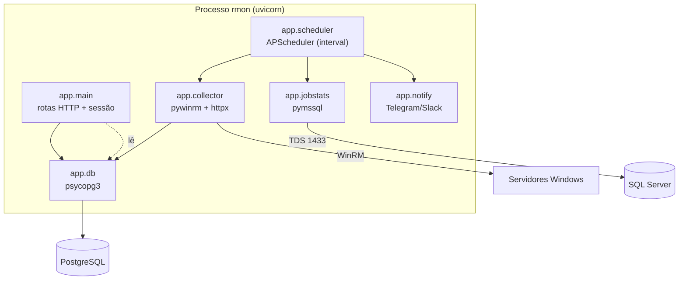

# Arquitetura

Como o RMonitor funciona por dentro.

## Visão geral

O RMonitor é uma aplicação **FastAPI** servida por **uvicorn**, com um agendador
**APScheduler** em background que faz o *polling* dos servidores Windows. Tudo roda num
único processo, como serviço `systemd`, e persiste em **PostgreSQL**.

## Fluxo de coleta (por ciclo)

1. `scheduler.poll_all` roda a cada `poll_interval_seconds`, com um `ThreadPoolExecutor` (até 8 workers em paralelo).
2. Para cada servidor, `collector.collect_server`:
   - resolve a credencial do perfil (`config.credential_for`);
   - abre uma sessão WinRM e executa um **script PowerShell** que devolve JSON compacto (CPU, memória, discos, uptime, serviços, ocorrências do Event Log, nº de sessões);
   - checa `app_health` por HTTP (independente do WinRM);
   - **nunca levanta exceção** — erros são encapsulados no resultado.
3. Se o servidor tem bloco `jobs`, `jobstats.query` consulta o SQL Server.
4. `db.insert_check` grava o snapshot em `checks`.
5. `scheduler._problems` avalia o resultado contra os limiares; problemas **novos** e
   **resolvidos** viram registros em `alerts_log` e, se houver canal, notificação
   (comparando com o estado anterior em memória — só transições).
6. A cada 6h, `db.prune` remove histórico antigo.

O primeiro ciclo é disparado imediatamente no start (thread única) para popular o
painel sem esperar o primeiro intervalo.

## Coleta remota: PowerShell via WinRM

O `collector` monta um template PowerShell substituindo *placeholders*
(`__SERVICES__`, `__LOGS__`, `__NOISE_IDS__`, `__PROV_RE__`, …) e o executa com
`Session.run_ps`. O script:

- usa `Get-CimInstance` para host/discos/serviços;
- filtra o Event Log por nível (Crítico/Erro), janela temporal, IDs de ruído e regex de provedor, **agrupando** por origem+ID;
- devolve tudo via `ConvertTo-Json -Compress`.

> **Detalhe do PowerShell 5.1:** coleções de 1 elemento são serializadas como objeto
> único (não array). O helper `_as_list` normaliza isso no Python.

### Segurança das ações remotas

- `service_action` só aceita serviços **que estão no inventário daquele servidor** e valida o nome por regex antes de montar o comando.
- `logoff_session` converte o ID para inteiro antes de usá-lo — impede injeção no comando `logoff`.
- Ambas exigem perfil **admin** na rota e credencial administradora no alvo.

## Camada de dados (PostgreSQL)

`app/db.py` usa **psycopg3** com conexões curtas e `autocommit` (sem estado
compartilhado entre threads). O schema é criado/migrado no start (`init_db`) de forma
idempotente (`CREATE TABLE IF NOT EXISTS`, `ALTER TABLE ... ADD COLUMN IF NOT EXISTS`).

| Tabela | Conteúdo |
|---|---|
| `users` | Usuários do painel (username, hash pbkdf2, papel, ativo, último login, nome, e-mail) |
| `checks` | Snapshot por servidor/ciclo (métricas + `disks`/`services`/`events`/`jobs` em `jsonb`) |
| `audit_log` | Auditoria de ações (login, restart, logoff, config…) |
| `alerts_log` | Histórico de problemas levantados/resolvidos |
| `app_config` | Configuração runtime (tema/refresh da UI, limiares de alerta) em `jsonb` |

Índices por `ts DESC` e por `(server, ts DESC)` sustentam as consultas de histórico e
"último por servidor" (`SELECT DISTINCT ON (server) …`).

## Autenticação e sessão

- `SessionMiddleware` (Starlette) com cookie assinado por `RMON_SECRET_KEY` (`same_site=lax`).
- Senhas: `security.hash_password` — **pbkdf2-hmac-sha256**, 240k iterações, salt de 16 bytes, formato `pbkdf2_sha256$<iter>$<salt>$<hash>`. Verificação com `hmac.compare_digest` (tempo constante).
- O admin inicial é semeado no 1º start a partir do `.env`, se não houver usuários.

## Configuração em duas fontes

- **`.env`** → `config.load_settings()` (segredos, DSN, bind). Lido por parser Python próprio.
- **`servers.yaml`** → `config.load_inventory()` (o que monitorar).

### Por que não `EnvironmentFile` no systemd?

O `systemd` interpreta escapes de barra invertida (`\r`, `\t`, `\u`…) em
`EnvironmentFile`, o que **corromperia** usuários no formato `DOMINIO\usuario`. Por isso
a unit **não** usa `EnvironmentFile`; a própria aplicação lê `/opt/rmon/.env` com Python
(parser correto, barra literal preservada) e o `ExecStart` fixa `--host 0.0.0.0 --port 8080`.

## Enderecamento HTTP (endpoints)

Além das telas (ver [OPERACAO.md](OPERACAO.md#telas-do-painel)):

| Endpoint | Método | Descrição |
|---|---|---|
| `/healthz` | GET | Liveness — `{"status":"ok","version":...}` (sem auth) |
| `/api/status` | GET | Último check de cada servidor (JSON, requer login) |
| `/api/series?server=&hours=` | GET | Série temporal para gráficos (JSON, requer login) |
| `/api/tv` | GET | Estado completo do mural: KPIs, cartões e ocorrências já classificados por severidade (JSON, requer login; cache de 3 s no processo) |
| `/service/action` | POST | start/stop/restart de serviço (admin) |
| `/sessions/logoff` | POST | Logoff de sessões selecionadas (admin) |

## Perfil `viewer` (quiosque)

Um middleware registrado **antes** do `SessionMiddleware` (portanto por dentro dele na
pilha, com `request.session` já disponível) restringe quem não é `admin` a um punhado de
rotas: `/`, `/tv`, `/api/tv`, `/login`, `/logout`, `/healthz` e `/static/*`. GET em
qualquer outra rota volta para `/`; POST e `/api/*` recebem `403`. Como a regra vive no
middleware, uma rota nova nasce fechada para o `viewer` — não há como esquecer o guard.

A severidade exibida no mural reutiliza `scheduler.problems()`, a **mesma** função que
decide os alertas do Telegram/Slack: o que acende vermelho na TV é exatamente o que
dispara notificação. Sem contato, serviço parado, app fora do ar e jobs falhando contam
como críticos; memória, disco e app lento como avisos.

## Endurecimento do serviço (systemd)

A unit `deploy/rmon.service` roda como usuário dedicado `rmon` com sandbox:
`NoNewPrivileges`, `PrivateTmp`, `ProtectSystem=strict`, `ProtectHome`,
`ProtectKernelTunables`, `ProtectControlGroups`, `RestrictSUIDSGID` e `ReadWritePaths`
limitado a `/opt/rmon/data`.
